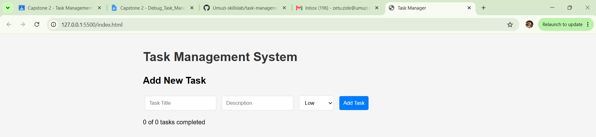
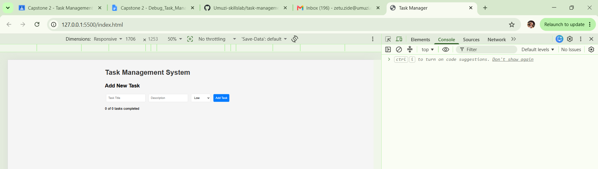
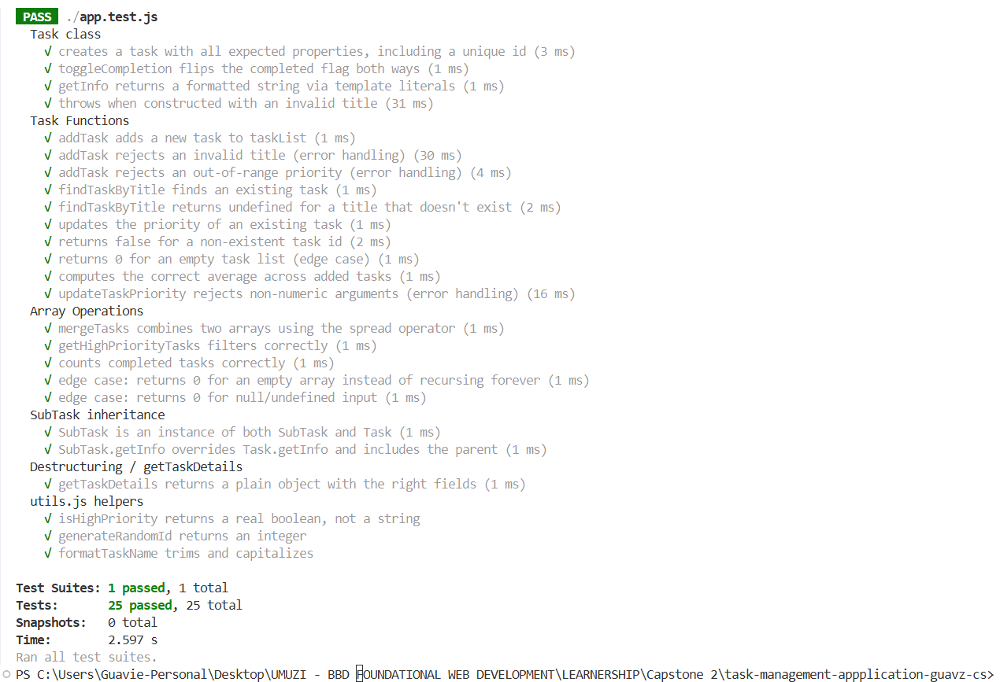
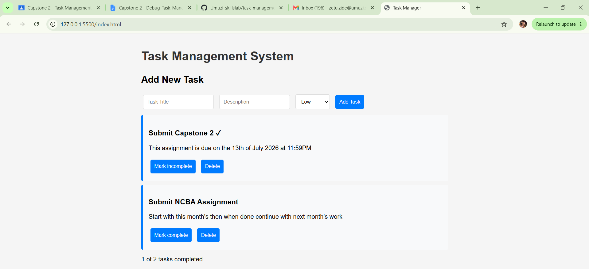

[](https://classroom.github.com/online_ide?assignment_repo_id=24124904&assignment_repo_type=AssignmentRepo)
# Task Manager - Capstone 2 

## Overview

The app lets you add tasks with a title, description and priority, mark
them complete, delete them, and see a running completed/total count. Data
persists to `localStorage` so tasks survive a page refresh. The codebase
is split into the following ES6 modules including a testing module:

- `utils.js` — small helpers (storage, id generation, priority checks)
- `app.js` — task-management logic and the `TaskManager` object
- `dom.js` — all browser/DOM code; the only file that touches `document`
- `app.test.js` — Jest test suite

## Errors Found
The starter application contained more than 15 issues across the following categories:

- **Variables & Operators:** Implicit global variables, incorrect use of `var`, misuse of assignment (`=`) and loose equality (`==`), and inconsistent variable declarations.
- **Control Flow:** Off-by-one loop errors, infinite loops, missing recursion base cases, missing empty-array guards, and premature DOM initialization.
- **Functions & Functional Programming:** Missing function parameters, reliance on global state, lack of higher-order functions, minimal use of array methods, and manual looping.
- **Object-Oriented Programming:** Missing class properties and methods, incorrect inheritance (`super()`), and incomplete `TaskManager` functionality.
- **Modern JavaScript (ES6+):** Missing template literals, destructuring, spread/rest operators, and ES6 module imports/exports.
- **DOM Manipulation:** Incorrect selectors, missing null checks, duplicate rendering, improper event handling, and lack of event delegation.
- **Data Persistence:** Incorrect `localStorage` handling due to missing `JSON.stringify()` and `JSON.parse()`.
- **Testing:** Missing imports, insufficient test coverage, no test state reset, and lack of edge case testing.
- **Error Handling & Code Quality:** Missing input validation, absence of `try...catch` blocks, and limited code documentation.

## Fixes Implemented

- **Variables & operators**: all `var` replaced with `let`/`const`; the
  implicit global `taskList` now has a proper `let` declaration; every
  `==` and stray `=` inside a condition replaced with `===`.
- **Control flow**: fixed the off-by-one `for` loop and the infinite
  `while` loop; added a real base case to the recursive
  `countCompletedTasks`; guarded `calculateAveragePriority` against an
  empty array; wrapped DOM setup in `DOMContentLoaded`.
- **Functions & functional programming**: added the missing `title`
  parameter to `findTaskByTitle`; replaced manual loops with `map`,
  `filter`, `reduce`, `find`, `some`, and `every`; added a higher-order
  function.
- **OOP**: `Task` now has an `id` and `toggleCompletion()`; `SubTask`
  correctly calls `super()` before using `this`; `TaskManager` gained two
  new methods and a getter so its `tasks` list can never go stale.
- **Modern JavaScript**: added object and function-parameter
  destructuring, template literals everywhere string concatenation used
  to be, the spread operator (`mergeTasks`, array copies), a rest
  parameter, and ES6 `import`/`export` across all four modules.
- **DOM**: corrected the selector bugs, added null checks, cleared the
  container before re-rendering (fixing duplicate tasks), switched task
  id lookup to `data-*` attributes with event delegation on the task
  list container, and added JSON-aware `localStorage` save/load.
- **Testing**: rewrote `app.test.js` with real imports, a `beforeEach`
  reset, and 25 passing tests covering every required category
  (classes, inheritance, array ops, recursion, destructuring, edge cases,
  error handling).
- **Error handling & quality**: added `try/catch` around storage and task
  creation, `typeof`/range validation on task inputs, and comments
  throughout explaining *why* each fix was needed, not just what changed.


## Features Added

- ES6 modules (`import`/`export`)
- Template literals
- Object and array destructuring
- Spread and rest operators
- Higher-order functions
- Functional array methods (`map`, `filter`, `reduce`, `find`)
- Event delegation
- Recursive function with a base case
- LocalStorage persistence using JSON
- Comprehensive Jest test suite (25 passing tests)

## Getting Started

Because the app uses real ES6 modules (`<script type="module">`), open it
through a local server rather than double-clicking `index.html` (browsers
block module imports over the `file://` protocol):

1. Install dependencies: `npm install`
2. Right-click on the `index.html` file then run it on the live server, this should open the app on your browser.

## Testing

Install dependencies:

```bash
npm install
```

Run the test suite:

```bash
npm test
```

Expected result:

- 25 tests passing
- 0 test failures

## Screenshots

Application Running in Browser


Console Showing No Errors


Jest Test Results


DOM Manipulation Features Working


## Reflection

The most challenging part of this project was debugging the existing code while ensuring every change still met the project requirements. Identifying hidden issues such as infinite loops, recursion without a base case, and incorrect inheritance required careful testing and debugging.

This project strengthened my understanding of modern JavaScript, ES6 modules, object-oriented programming, functional programming, DOM manipulation, and unit testing with Jest especially. It also reinforced the importance of writing clean, maintainable, and well-tested code.
